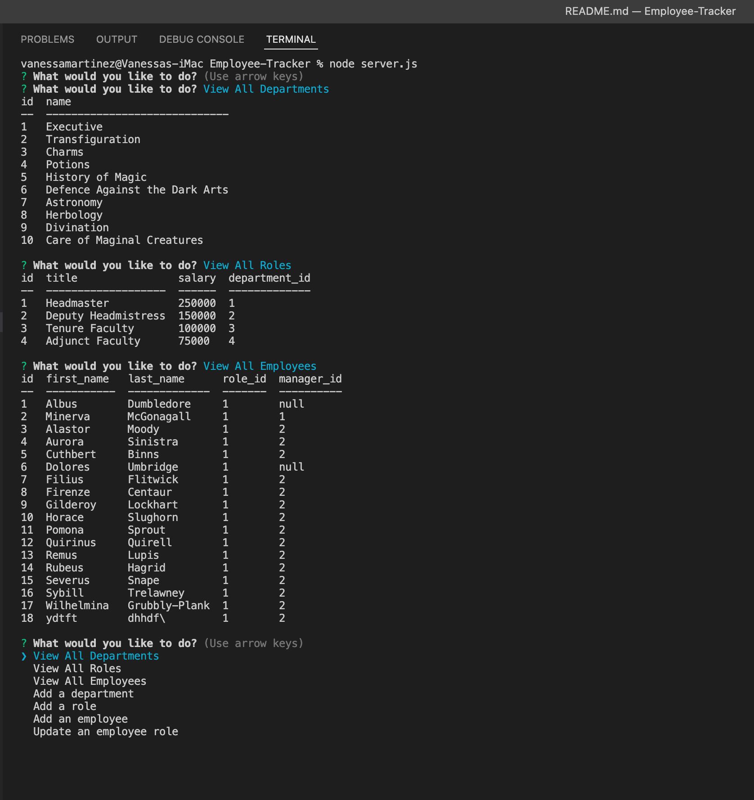

# Employee-Tracker

Author: Vanessa Martinez
<br>
Github Link: https://github.com/marvanessa1/Employee-Tracker


[](https://opensource.org/licenses/MIT)

## Description

This is an employee management system that uses MySQL Shell, Node.js, and Inquirer to execute commands.


## Table of Contents

- [License](#license)
- [Installs](#installs)
- [Demo](#app-demo)
- [Contact Me](#contact-me)

## License

Copyright 2022 Vanessa Martinez

Permission is hereby granted, free of charge, to any person obtaining a copy of this software and associated documentation files (the "Software"), to deal in the Software without restriction, including without limitation the rights to use, copy, modify, merge, publish, distribute, sublicense, and/or sell copies of the Software, and to permit persons to whom the Software is furnished to do so, subject to the following conditions:

The above copyright notice and this permission notice shall be included in all copies or substantial portions of the Software.

THE SOFTWARE IS PROVIDED "AS IS", WITHOUT WARRANTY OF ANY KIND, EXPRESS OR IMPLIED, INCLUDING BUT NOT LIMITED TO THE WARRANTIES OF MERCHANTABILITY, FITNESS FOR A PARTICULAR PURPOSE AND NONINFRINGEMENT. IN NO EVENT SHALL THE AUTHORS OR COPYRIGHT HOLDERS BE LIABLE FOR ANY CLAIM, DAMAGES OR OTHER LIABILITY, WHETHER IN AN ACTION OF CONTRACT, TORT OR OTHERWISE, ARISING FROM, OUT OF OR IN CONNECTION WITH THE SOFTWARE OR THE USE OR OTHER DEALINGS IN THE SOFTWARE.

## Installs

1. Clone this github repository
2. Go to reposisory in local directory
3. Install dependencies by running comand below:

```
npm i
```
4.  Next, open connection.js file located in the db folder and enter your mysql host, username, and password

5. In the terminal, run the follwing command to initiate mysql, with your username inside the carets:

```
mysql -u <mysql username> -p
```
6. Enter your mysql password

7.  To source the schema.sql and seed data, run the following commands:
```
source db/schema.sql;
```
```
source db/seed.sql;
```
8.  To exit the mysql shell, enter the following command

```
quit
```
9. To initiate node, run the following command:
```
node server.js
```


## App Demo

- [Demo Walkthrough](https://watch.screencastify.com/v/FJHsrtGFFhYaMOu48Opa) 

## Contact Me

Find me on GitHub at marvanessa1 or email at marvanessa1@live.com if you have any comments or questions. Thank you!